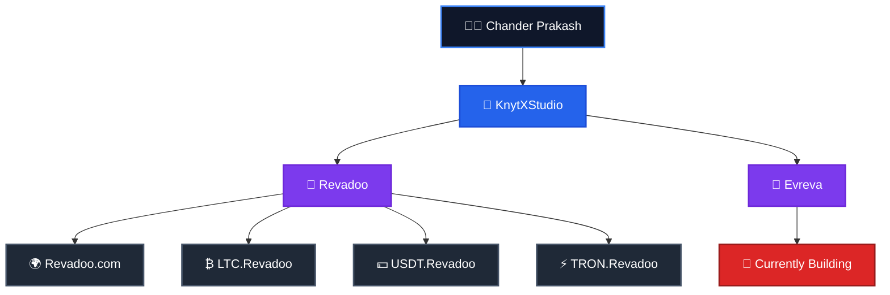

<h1 align="center">Hi 👋, I'm Chander Prakash</h1>

<h3 align="center">
🚀 Full-Stack & Blockchain Developer
</h3>

Building scalable web applications, blockchain solutions, and modern digital products.

---

# 👨‍💻 About Me

I'm **Chander Prakash**, a passionate **Full-Stack & Blockchain Developer** who enjoys building secure, scalable, and high-performance software.

I'm the **Founder of KnytXStudio**, an independent development studio where I transform ideas into production-ready digital products.

Under **KnytXStudio**, I've developed **Revadoo**, a modern rewards and engagement platform. Alongside the main platform, I've built dedicated cryptocurrency portals including **LTC.Revadoo**, **USDT.Revadoo**, and **TRON.Revadoo**, forming the **Revadoo ecosystem**.

🚀 I'm currently building **Evreva**, a next-generation platform focused on performance, scalability, and exceptional user experience.

---

# 🌍 Project Ecosystem

---

# 💻 Tech Stack

## 🌐 Frontend

---

## ⚙️ Backend

---

## ⛓️ Blockchain

---

## 🛠️ Tools

---

# 🚀 Featured Projects

## 🚀 Evreva *(Currently Building)*

A next-generation platform engineered for performance, scalability, and exceptional user experience.

---

## 🎯 Revadoo

A modern rewards and engagement platform built using **React**, **Node.js**, **Express**, and **MongoDB**.

---

## 🏢 KnytXStudio

An independent development studio dedicated to creating modern web applications, blockchain solutions, and innovative digital products.

---

# 🎯 Current Focus

- 🚀 Building **Evreva**
- 🌐 Expanding the **Revadoo Ecosystem**
- ⛓️ Full-Stack Development
- ⛓️ Blockchain Development
- 🤖 Artificial Intelligence
- 🔐 Secure Software Engineering
- 📚 Continuous Learning

---

## 💡 Philosophy

> **"Turning ideas into scalable, secure, and meaningful digital products."**

⭐ **Thanks for visiting my profile!**

