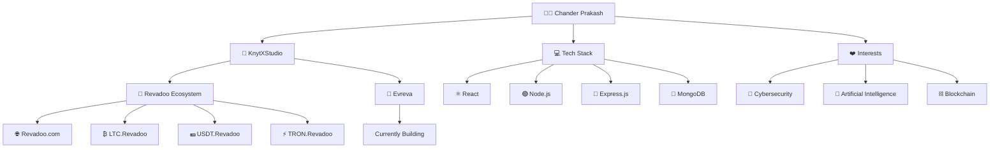

<h1 align="center">Hi 👋, I'm Chander Prakash</h1>

<h3 align="center">
🚀 Full-Stack Developer • 🔐 Cybersecurity Enthusiast • 🤖 AI Explorer
</h3>

Building secure, scalable and modern web applications.

---

# 🚀 About Me

I'm **Chander Prakash**, a passionate **Full-Stack Developer** focused on building secure, scalable, and high-performance web applications.

I am the **Founder of KnytXStudio**, where I design, develop, and deploy modern digital products from concept to production.

### 💼 Under KnytXStudio

### 🎯 Revadoo Ecosystem

- 🌐 **Revadoo.com** – Main rewards & engagement platform
- ₿ **LTC.Revadoo** – Litecoin knowledge portal
- 💵 **USDT.Revadoo** – USDT information portal
- ⚡ **TRON.Revadoo** – TRON blockchain information portal

### 🚀 Current Project

**Evreva**

Currently building a next-generation platform focused on:

- High Performance
- Modern UI/UX
- Scalability
- Security
- Real-world usability

---

# 🌍 Project Ecosystem

---

# 🛠️ Tech Stack

## Frontend

## Backend

## Tools

---

# 🚀 Featured Projects

| Project | Description |
|---------|-------------|
| 🚀 **Evreva** | Currently building a modern, scalable platform focused on performance and user experience. |
| 🎯 **Revadoo** | A full-stack rewards and engagement platform built with React, Node.js, Express, and MongoDB. |
| 💰 **LTC.Revadoo** | Cryptocurrency information portal dedicated to Litecoin. |
| 💵 **USDT.Revadoo** | Cryptocurrency information portal dedicated to Tether (USDT). |
| ⚡ **TRON.Revadoo** | Cryptocurrency information portal dedicated to the TRON ecosystem. |
| 💼 **KnytXStudio** | Development studio for creating modern web applications and digital products. |

---

# 📊 GitHub Analytics

---

# 🔥 Contribution Streak

---

# 📈 Contribution Graph

---

# 🎯 Current Focus

- 🚀 Building **Evreva**
- 🌐 Expanding the **Revadoo Ecosystem**
- 🔐 Learning Cybersecurity
- 🤖 Exploring Artificial Intelligence
- ⛓️ Building Blockchain-based Applications
- 📚 Continuously improving as a Full-Stack Developer

---

# 🌐 Connect With Me

---

## 💡 Philosophy

*"Great software is not just written—it is designed, secured, optimized, and continuously improved."*

⭐ If you like my work, consider following my journey and exploring my projects!

