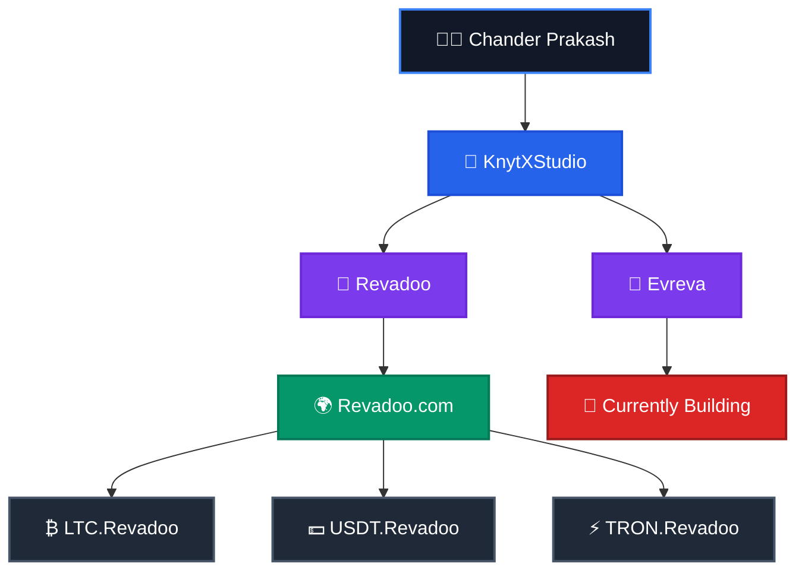

<h1 align="center">Hi 👋, I'm Chander Prakash</h1>

<h3 align="center">
🚀 Full-Stack & Blockchain Developer
</h3>

Building scalable web applications, blockchain solutions, and modern digital products.

---

# 👨‍💻 About Me

I'm **Chander Prakash**, a passionate **Full-Stack & Blockchain Developer** dedicated to building secure, scalable, and high-performance software.

I'm the **Founder of KnytXStudio**, an independent development studio where I transform ideas into production-ready digital products.

Under **KnytXStudio**, I've developed **Revadoo**, a modern rewards and engagement platform. Alongside the main platform, I've built dedicated cryptocurrency portals for **Litecoin (LTC)**, **USDT**, and **TRON**, creating the **Revadoo ecosystem**.

🚀 I'm currently building **Evreva**, a next-generation platform focused on performance, scalability, and exceptional user experience.

---

# 🌍 Project Ecosystem

---

### 💡 Philosophy

> **"Turning ideas into scalable, secure, and meaningful digital products."**

⭐ Thanks for visiting my profile!

