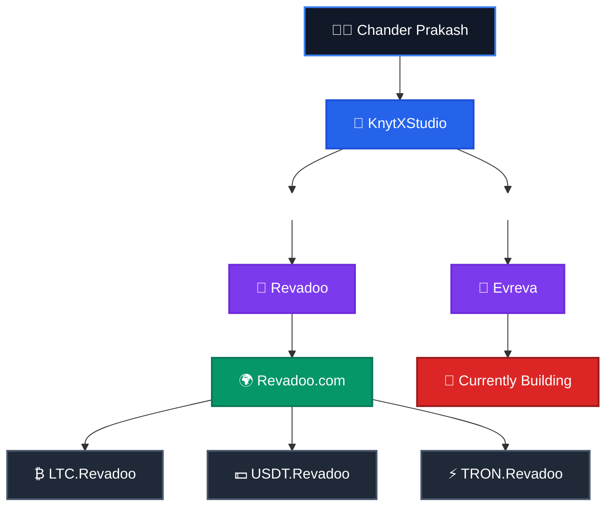

<h1 align="center">Hi 👋, I'm Chander Prakash</h1>

<h3 align="center">
🚀 Full-Stack & Blockchain Developer
</h3>

Building scalable web applications, blockchain solutions, and modern digital products.

---

# 👨‍💻 About Me

I'm **Chander Prakash**, a passionate **Full-Stack & Blockchain Developer** dedicated to building secure, scalable, and high-performance software.

I'm the **Founder of KnytXStudio**, an independent development studio where I transform ideas into production-ready digital products.

### 🏢 KnytXStudio

Under **KnytXStudio**, I develop modern web platforms and blockchain-powered solutions.

One of the flagship products is **Revadoo**, a rewards and engagement platform that has grown into its own ecosystem.

The **Revadoo Ecosystem** consists of:

- 🌍 **Revadoo.com** — Main Platform
- ₿ **LTC.Revadoo** — Litecoin Portal
- 💵 **USDT.Revadoo** — Tether (USDT) Portal
- ⚡ **TRON.Revadoo** — TRON Portal

🚀 I'm currently building **Evreva**, a next-generation platform focused on performance, scalability, and exceptional user experience.

---

# 🌍 Project Ecosystem

---

## 💡 Philosophy

> **"Turning ideas into scalable, secure, and meaningful digital products."**

⭐ Thanks for visiting my profile!

