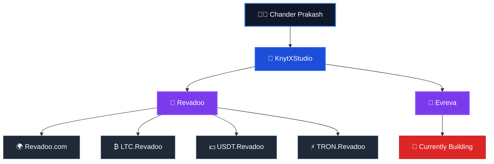

<h1 align="center">Hi 👋, I'm Chander Prakash</h1>

<h3 align="center">
🚀 Full-Stack & Blockchain Developer
</h3>

Building scalable web applications, blockchain solutions, and digital products.

---

# 👨‍💻 About Me

I'm **Chander Prakash**, a passionate **Full-Stack & Blockchain Developer** dedicated to building secure, scalable, and high-performance software.

I'm the **Founder of KnytXStudio**, an independent development studio where I transform ideas into production-ready digital products.

## 🏢 About KnytXStudio

KnytXStudio is where I design, develop, and maintain modern web applications, blockchain solutions, and digital platforms.

### Products built under KnytXStudio

- 🚀 **Revadoo** — Rewards & Engagement Platform
- 🌐 **LTC.Revadoo**
- 💵 **USDT.Revadoo**
- ⚡ **TRON.Revadoo**
- 🚀 **Evreva** *(Currently Building)*

My current focus is building products that combine modern web technologies, blockchain, and scalable backend architecture while continuously exploring Artificial Intelligence and secure software engineering.

---

# 🌍 Project Ecosystem

---

# 💻 Tech Stack

## 🌐 Frontend

---

## ⚙️ Backend

---

## ⛓️ Blockchain

---

## 🛠️ Tools

---

# 🚀 Featured Projects

## 🚀 Evreva *(Currently Building)*

Building a modern platform focused on performance, scalability, and exceptional user experience.

---

## 🎯 Revadoo

A rewards and engagement platform built with React, Node.js, Express, and MongoDB.

---

## 🌐 Revadoo Ecosystem

- 🌍 Revadoo.com
- ₿ LTC.Revadoo
- 💵 USDT.Revadoo
- ⚡ TRON.Revadoo

Dedicated cryptocurrency portals built under the Revadoo ecosystem.

---

## 🏢 KnytXStudio

An independent development studio creating modern web applications, blockchain solutions, and digital products.

---

# 🎯 Current Focus

- 🚀 Building **Evreva**
- 🌐 Growing the **Revadoo Ecosystem**
- ⛓️ Full-Stack Development
- ⛓️ Blockchain Development
- 🤖 Artificial Intelligence
- 🔐 Secure Software Engineering
- 📚 Continuous Learning

---

## 💡 Philosophy

> **"Turning ideas into scalable, secure, and meaningful digital products."**

⭐ Thanks for visiting my profile!

