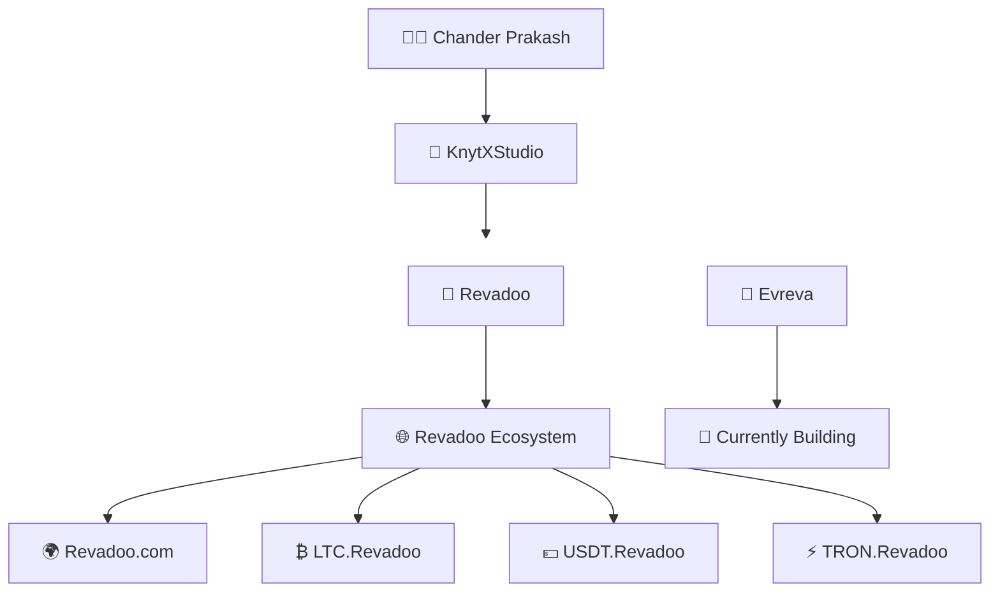

<h1 align="center">Hi 👋, I'm Chander Prakash</h1>

<h3 align="center">
🚀 Full-Stack & Blockchain Developer • 🤖 AI Explorer
</h3>

Building modern, scalable, and impactful digital products.

---

# 🚀 About Me

I'm **Chander Prakash**, a passionate **Full-Stack & Blockchain Developer** dedicated to building modern, scalable, and high-performance digital products.

I founded **KnytXStudio**, my independent development studio, where I design, develop, and deploy full-stack web applications, blockchain solutions, and digital products from concept to production.

One of the flagship projects developed under KnytXStudio is **Revadoo**, a modern rewards and engagement platform. Alongside the main platform, I created a growing **Revadoo Ecosystem** that includes dedicated cryptocurrency portals for **Litecoin (LTC)**, **Tether (USDT)**, and **TRON**, each designed to provide focused content and resources for their respective communities.

I'm currently building **Evreva**, a next-generation platform focused on performance, scalability, modern architecture, and exceptional user experience.

Outside of development, I'm continuously expanding my expertise in **Artificial Intelligence**, **Blockchain Technologies**, and **Secure Software Engineering** while building products that solve real-world problems.

---

# 🌍 Project Ecosystem

---

# 💻 Tech Stack

## 🌐 Frontend

---

## ⚙️ Backend

---

## ⛓️ Blockchain

---

## 🛠️ Tools & Platforms

---

# 🚀 Featured Projects

### 🚀 Evreva *(Currently Building)*

A next-generation platform engineered for scalability, performance, and an exceptional user experience.

---

### 🎯 Revadoo

A full-stack rewards and engagement platform built using React, Node.js, Express, and MongoDB.

---

### 🌐 Revadoo Ecosystem

- 🌍 Revadoo.com
- ₿ LTC.Revadoo
- 💵 USDT.Revadoo
- ⚡ TRON.Revadoo

Dedicated cryptocurrency portals developed as part of the Revadoo ecosystem.

---

### 🏢 KnytXStudio

An independent development studio focused on creating modern web applications, blockchain solutions, and innovative digital products.

---

# 🎯 Current Focus

- 🚀 Building **Evreva**
- 🌐 Expanding the **Revadoo Ecosystem**
- ⛓️ Full-Stack & Blockchain Development
- 🤖 Artificial Intelligence
- 🔐 Secure Software Engineering
- 📚 Continuous Learning & Open Source

---

## 💡 Philosophy

> **"Building technology that is scalable, secure, and creates meaningful impact."**

⭐ Thanks for visiting my profile!

