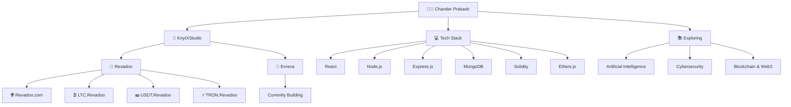

<h1 align="center">Hi 👋, I'm Chander Prakash</h1>

<h3 align="center">
🚀 Full-Stack & Blockchain Developer • 🤖 AI Explorer
</h3>

Building modern, scalable, and secure digital products.

---

# 🚀 About Me

I'm **Chander Prakash**, a passionate **Full-Stack & Blockchain Developer** who enjoys building modern, scalable, and high-performance applications.

I'm the **Founder of KnytXStudio**, where I design and develop full-stack web applications, blockchain solutions, and digital products from concept to deployment.

### 🚀 Currently Building

**Evreva** — A next-generation platform focused on performance, scalability, and exceptional user experience.

### 🏢 KnytXStudio Portfolio

Under **KnytXStudio**, I've built:

- 🚀 **Revadoo** – A modern rewards & engagement platform.
- 🌐 **Revadoo Ecosystem**
  - ₿ **ltc.revadoo.com**
  - 💵 **usdt.revadoo.com**
  - ⚡ **tron.revadoo.com**

Alongside my projects, I'm continuously expanding my knowledge in:

- 🤖 Artificial Intelligence
- 🔐 Cybersecurity
- ☁️ Cloud Technologies
- ⛓️ Blockchain & Web3

---

# 🌍 Project Ecosystem

---

# 💻 Tech Stack

## 🌐 Frontend

---

## ⚙️ Backend

---

## ⛓️ Blockchain

---

## 🛠️ Tools

---

# 🚀 Featured Projects

## 🚀 Evreva *(Currently Building)*

Building a modern, scalable platform designed for performance, security, and user experience.

---

## 🎯 Revadoo

A full-stack rewards & engagement platform built with React, Node.js, Express, MongoDB, and modern web technologies.

---

## 🌐 Revadoo Ecosystem

- 🌐 Revadoo.com
- ₿ LTC.Revadoo
- 💵 USDT.Revadoo
- ⚡ TRON.Revadoo

---

## 🏢 KnytXStudio

A development studio focused on building scalable web platforms, blockchain applications, and digital products.

---

# 🎯 Current Focus

- 🚀 Building **Evreva**
- 🌐 Growing the **Revadoo Ecosystem**
- ⛓️ Blockchain Development
- 🤖 Artificial Intelligence
- 🔐 Cybersecurity
- 📚 Continuous Learning & Open Source
