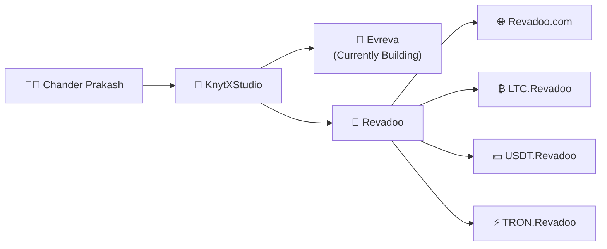

<h1 align="center">Hi 👋, I'm Chander Prakash</h1>

<h3 align="center">
🚀 Full-Stack & Blockchain Developer • 🤖 AI Explorer
</h3>

Building modern, scalable, and impactful digital products.

---

# 🚀 About Me

I'm **Chander Prakash**, a passionate **Full-Stack & Blockchain Developer** focused on building scalable, secure, and high-performance web applications.

I'm the **Founder of KnytXStudio**, a development studio where I transform ideas into production-ready software using modern web technologies and blockchain solutions.

Under **KnytXStudio**, I built the **Revadoo Ecosystem**, which includes the main platform along with dedicated cryptocurrency portals for **Litecoin**, **USDT**, and **TRON**.

I'm currently building **Evreva**, my next-generation platform designed with a strong focus on performance, scalability, and user experience.

---

# 🌍 Project Ecosystem

---

# 💻 Tech Stack

## 🌐 Frontend

---

## ⚙️ Backend

---

## ⛓️ Blockchain

---

## 🛠️ Tools & Technologies

---

# 🚀 Featured Projects

## 🚀 Evreva *(Currently Building)*

A next-generation platform engineered for performance, scalability, and an exceptional user experience.

---

## 🎯 Revadoo

A modern rewards and engagement platform built using React, Node.js, Express, and MongoDB.

---

## 🌐 Revadoo Ecosystem

The Revadoo ecosystem extends beyond the core platform with dedicated cryptocurrency portals:

- 🌐 Revadoo.com
- ₿ LTC.Revadoo
- 💵 USDT.Revadoo
- ⚡ TRON.Revadoo

---

## 🏢 KnytXStudio

A development studio focused on building modern web applications, blockchain solutions, and digital products from idea to deployment.

---

# 🎯 Current Focus

- 🚀 Building **Evreva**
- 🌐 Expanding the **Revadoo Ecosystem**
- ⛓️ Full-Stack & Blockchain Development
- 🤖 Artificial Intelligence
- 🔐 Secure Software Development
- 📚 Learning, Building & Open Source

---

## 💡 Philosophy

> **"Build solutions that are scalable, secure, and create real-world impact."**

⭐ Thanks for visiting my profile!

